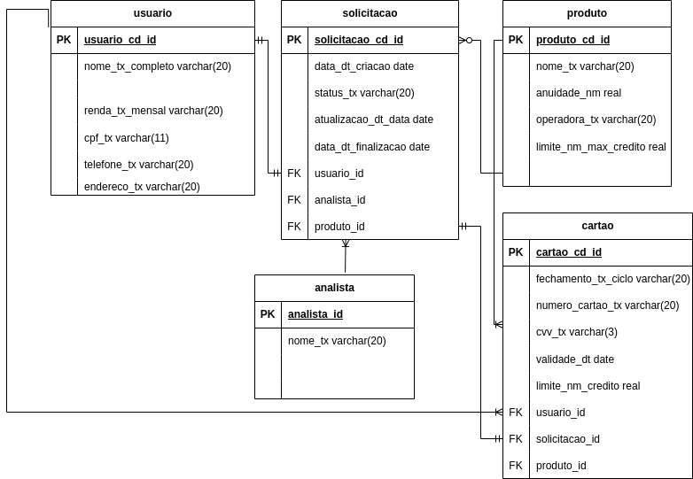

<h1 align="center"> Projeto individual Banco de Dados.</h1>
<h2>Neste sistema conseguimos visualisar a solicitação de um ou mais cartões. </h2>
<h3>Modelo Conceitual.</h3>

<h4>Modelo Lógico</h4>

 Tecnologias usadas:
- [Draw.io](https://app.diagrams.net/);
- [DBeaver 23.1.4](https://dbeaver.io/download/);
- [Postgre 15.4](https://www.postgresql.org/).

  
Feito por: 
https://github.com/LilianeDavid93) 

